# Case Técnico Dadosfera - Data Engineer Jr
Case desenvolvido por **João Victor Clivatti Massoni**

## Sumário
- [Setup](#setup)
- [Item 0 - Agilidade e Planejamento](#item-0---agilidade-e-planejamento)
- [Item 1 - Base de Dados](#item-1---base-de-dados)
- [Item 2 - Integração](#item-2---integração)
- [Item 3 - Exploração](#item-3---exploração)
- [Item 4 - Data Quality](#item-4---data-quality)
- [Item 5 - Processamento](#item-5---processamento)
- [Item 6 - Modelagem](#item-6---modelagem)
- [Item 7 - Análise](#item-7---análise)
- [Item 8 - Pipelines](#item-8---pipelines)
- [Item 9 - Data Apps](#item-9---data-apps)
- [Item 10 - Apresentação](#item-10---apresentação)
- [Item Bonus - GenAI + Data Apps](#item-bonus---genai--data-apps)

## Setup
Antes de executar localmente qualquer script Python presente neste repositório, é necessário criar um ambiente virtual (virtual environment), instalar os requisitos do projeto e, em seguida, ativar esse ambiente para a execução dos scripts.

Para facilitar o processo de criação, instalação e ativação do ambiente virtual, esta documentação disponibiliza três scripts de setup, um para cada sistema operacional:

⚠️ Antes de executá-los, é necessário conceder permissão de execução aos scripts com o comando `chmod +x setup/*.sh` no Linux/MacOS ou via interface gráfica (botão direito no arquivo -> propriedades -> permissões) no Windows.

- **Linux**: [linux_setup.sh](./setup/linux_setup.sh) (Compatível com Bash e Zsh), executar com o comando `./setup/linux_setup.sh`
- **Windows**: [windows_setup.sh](./setup/windows_setup.sh) (Compatível com CMD, adicionar '.ps1' ao fim da segunda linha do script para adaptar para PoweShell), executar com o comando `./setup/windows_setup.sh`
- **MacOS**: [macos_setup.sh](./setup/macos_setup.sh), executar com o comando `./setup/macos_setup.sh`

Após a execução do script correspondente ao seu sistema operacional, basta ativar o ambiente virtual no terminal que será utilizado para executar os scripts, garantindo que eles rodem dentro do ambiente configurado, utilizando o comando apropriado para o seu sistema:
- **Linux**: `source .venv/bin/activate` (Compatível com Bash e Zsh)
- **Windows**:
  
  - **CMD**: `.venv\Scripts\activate`
  - **PowerShell**: `.venv\Scripts\Activate.ps1`

- **MacOS**: `source .venv/bin/activate`

### Requisito adicional: JDK 17 (Apache Spark)

Este projeto utiliza Apache Spark para execução de alguns scripts.
Para que esses scripts funcionem corretamente, é obrigatório ter o Java Development Kit (JDK) versão 17 instalado e disponível no sistema.

O JDK 17 foi escolhido por ser a versão LTS recomendada e plenamente compatível com Apache Spark 3.x.

Sem o JDK 17:

- O Spark não inicializa corretamente

- Scripts PySpark falham na criação da SparkSession

**Verificação do Java instalado:**

Em qualquer sistema, é possível verificar com: `java -version`

A saída esperada deve indicar: `openjdk version "17.x.x"`

### Instalação do JDK 17 por sistema operacional:
🐧 **Linux**

**Debian / Ubuntu:**

```
sudo apt update
sudo apt install -y openjdk-17-jdk
```

**Arch / Manjaro:**

```
sudo pacman -Sy jdk17-openjdk
```

🍎 **macOS**

No macOS, recomenda-se o uso do Homebrew:

```
brew install openjdk@17
```

Após a instalação, pode ser necessário adicionar o Java ao PATH:

```
echo 'export PATH="/opt/homebrew/opt/openjdk@17/bin:$PATH"' >> ~/.zshrc
```


💡 Em Macs Intel, o caminho pode ser /usr/local/opt/openjdk@17.

🪟 **Windows**

No Windows, recomenda-se o uso do Chocolatey:

```
choco install openjdk17 -y
```

Alternativamente, o JDK 17 pode ser instalado manualmente a partir do site oficial da Eclipse Adoptium (Temurin).

Após a instalação, confirme se o Java está no PATH executando:

```
java -version
```

## Item 0 - Agilidade e Planejamento
Abaixo está o diagrama de todo o case representando o meu entendimento e planejamento do case como todo:
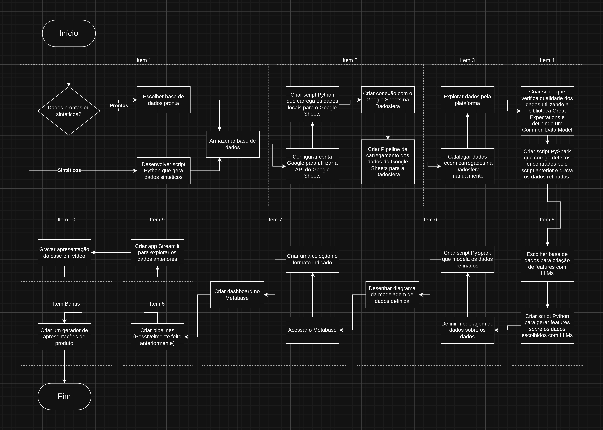

**OBS**: A documentação do case sugeria a realização do deploy do código de alguns itens (como o [8](#item-8---pipelines) e [9](#item-9---data-apps)) na plataforma da Dadosfera; porém, isso depende do acesso a módulos específicos da plataforma, os quais não me foram disponibilizados. A indisponibilidade foi comunicada por e-mail, sem retorno em tempo hábil para ajustes. Ainda assim, toda a arquitetura, ingestão, modelagem e disponibilização dos dados foram desenvolvidas de forma aderente às capacidades da Dadosfera. Peço, portanto, que esse contexto seja levado em consideração no momento da avaliação.

## Item 1 - Base de Dados
Na escolha do conjunto de dados optei por criar um script Python que gera e salva localmente uma base de dados sintéticos sobre vendas, que seriam vendas da empresa de e-commerce a qual a definição do case se refere.

O script gera 125 mil linhas de dados que apesar de sintéticos seguem uma coerência entre si, estanto de acordo com os requisitos definidos pelo case.

O arquivo do script esta localizado em [./scripts/bronze/generate_data.py](./scripts/bronze/generate_data.py) e os arquivos de dados em CSV que ele grava estão localizados em [./data/raw/synthetic_data_full.csv](./data/raw/synthetic_data_full.csv)(sendo o conjunto de dados completo) e [./data/raw/synthetic_data_sample.csv](./data/raw/synthetic_data_sample.csv)(sendo uma amostra de mil linhas do conjunto completo).

Para executar o script basta executar o comando `python -m scripts.bronze.generate_data` no terminal.

## Item 2 - Integração
Na etapa de integração e ingestão da base de dados gerada na plataforma da Dadosfera, inicialmente criei um script([./scripts/ingest.py](./scripts/ingest.py)) que grava os dados que estão armazenados localmente em uma planilha do Google Sheets no meu Google Drive pessoal para poder conectar a Dadosfera à essa planilha mais facilmente por estar na nuvem.

Antes mesmo de criar o script, comecei configurando a minha conta do Google para poder me comunicar com a API do Google, comecei ativando as APIs do Google Drive e do Google Sheets na seção "APIs e serviços" do Google Cloud Console:
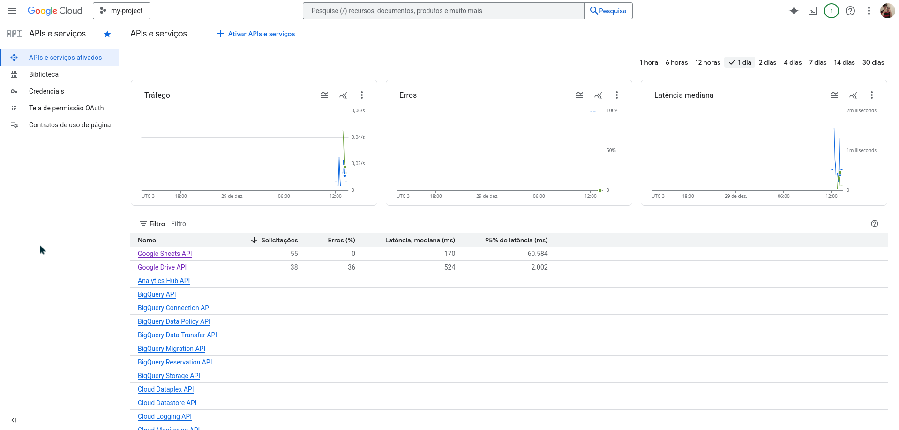

Ainda na seção "APIs e serviços", segui criando e posteriormente baixando credenciais pessoais para poder me comunicar com a API:
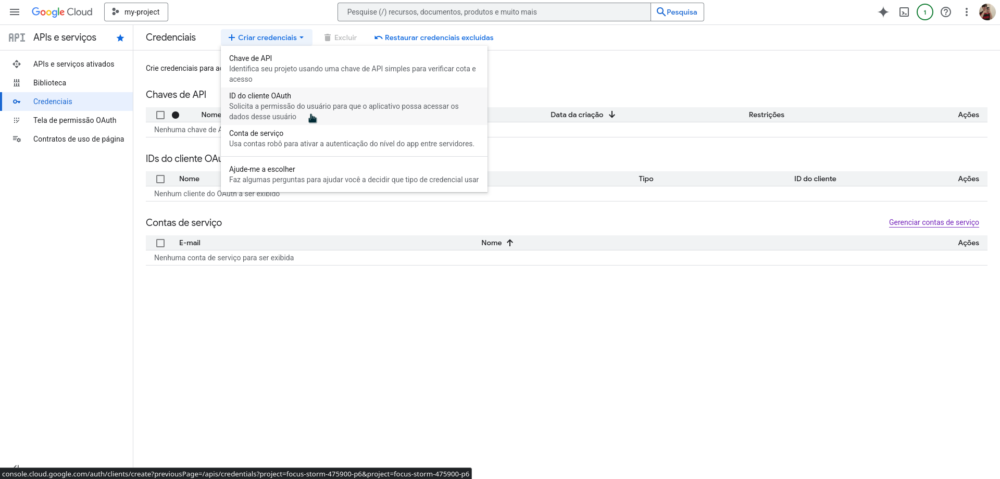
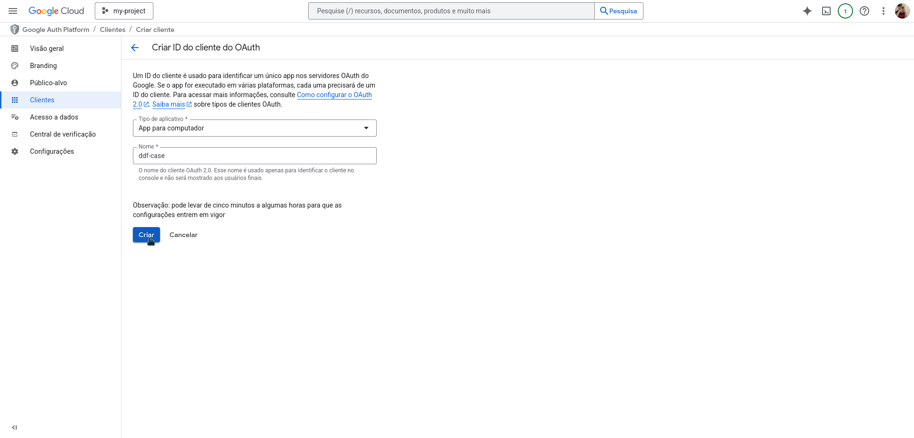
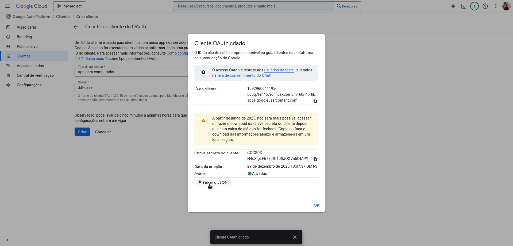

Para finalmente poder me comunicar com as APIs, movi o arquivo baixado de credenciais para a raiz do diretório do projeto e o renomeei para [client_secret.json](./client_secret.json)

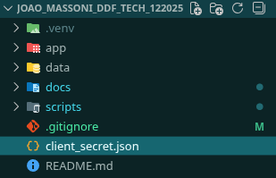

Com isso pude finalmente executar o script que move os dados para o Google Sheets, precisando apenas autorizar o script a manipular arquivos no meu Google Drive para que fosse criado o arquivo [token.json](./token.json) e não fosse necessária essa confirmação em execuções futuras. Para executar o script deve-se executa-lo como módulo: ```python -m scripts.ingest``` dentro do diretório raiz do projeto (lembrando que o venv deve ter sido criado e ativado) com os seguintes parametros
```python
if __name__ == "__main__":
    ingest_data_to_sheets(
        csv_file="./data/raw/synthetic_data_full.csv",
        secret_path="client_secret.json",
        env_path=".env",
        spreadsheet_name="raw_orders"
    )
```


Após o script ser executado com sucesso, pude verificar no meu Google Drive que a planilha com os dados havia sido gravada com sucesso.


Até esse ponto minha idéia era poder criar scripts que executassem toda a etapa de integração, desde os dados locais até os dados ingeridos na plataforma, porém infelizmente enfrentei muitas dificuldades utilizando a API da Dadosfera, senti que faltou uma melhor descrição e talvez exemplos de como consumir os endpoints da API e que tipo de valores deveriam ser colocados em cada campo(o máximo que consegui foi criar uma função para logar na API). Por isso optei por criar a conexão com o Google Sheets e executar a pipeline de integração manualmente pelo site.

Para terminar a integração dos dados, primeiro criei uma conexão com o Google Sheets manualmente na seção de conexões da plataforma da Dadosfera:

Comecei clicando em "Nova fonte"
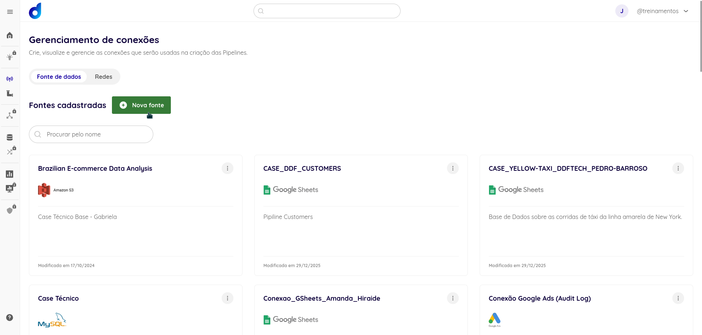

Em seguida selecionei o Google Sheets como fonte
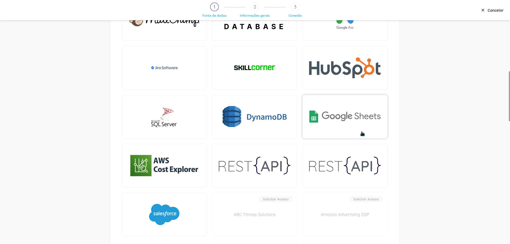

E preenchi as informações da conexão
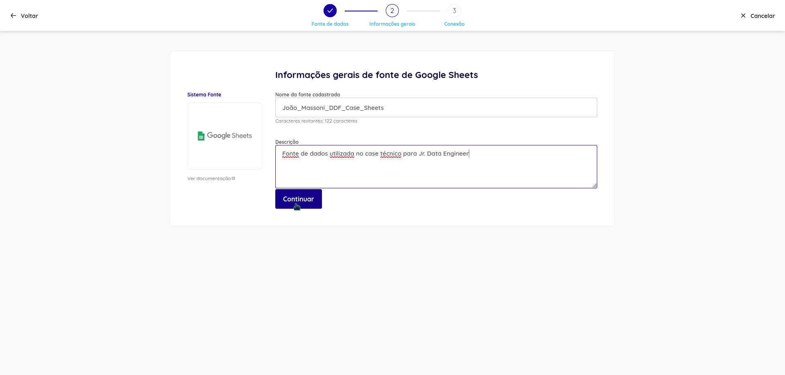
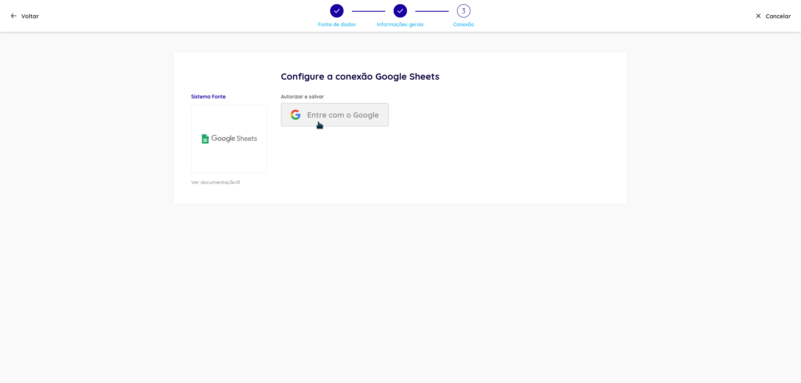

Depois de preencher as informações da conexão consegui cria-la com sucesso
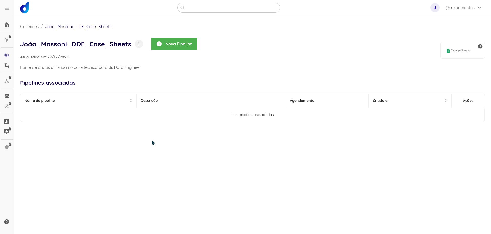
Link do ativo de conexão criado: [https://app.dadosfera.ai/pt-BR/collect/connections/1767033270091_3wte0afg_google-sheets-1.0.0](https://app.dadosfera.ai/pt-BR/collect/connections/1767033270091_3wte0afg_google-sheets-1.0.0)

Com a conexão criada parti para a criação da pipeline que foi a última etapa da integração:

Comecei clicando em "Nova pipeline" e depois em "Criar pipeline" no modal que o primeiro botão abriu
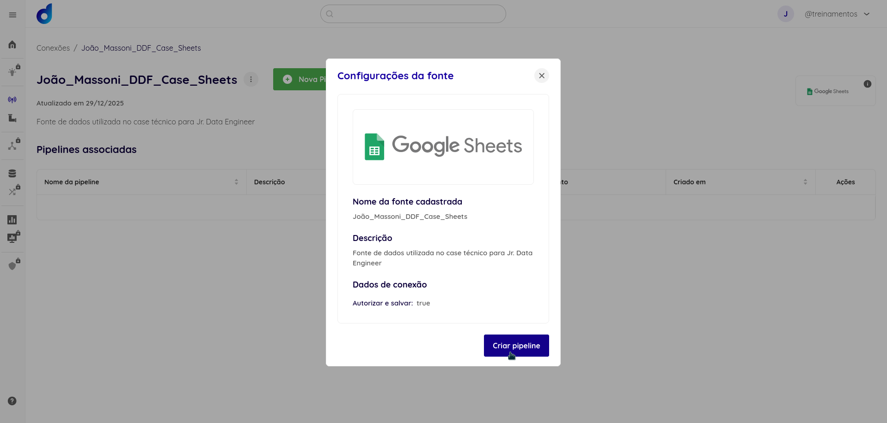

E preenchi as informações da pipeline
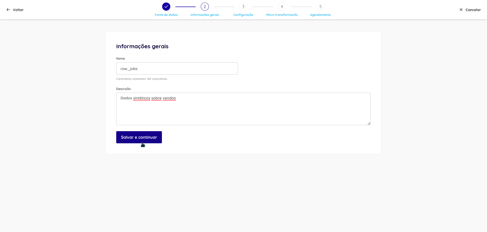
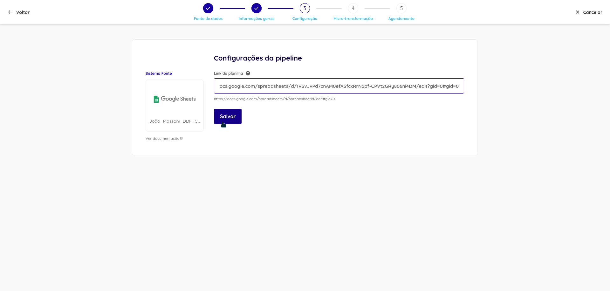
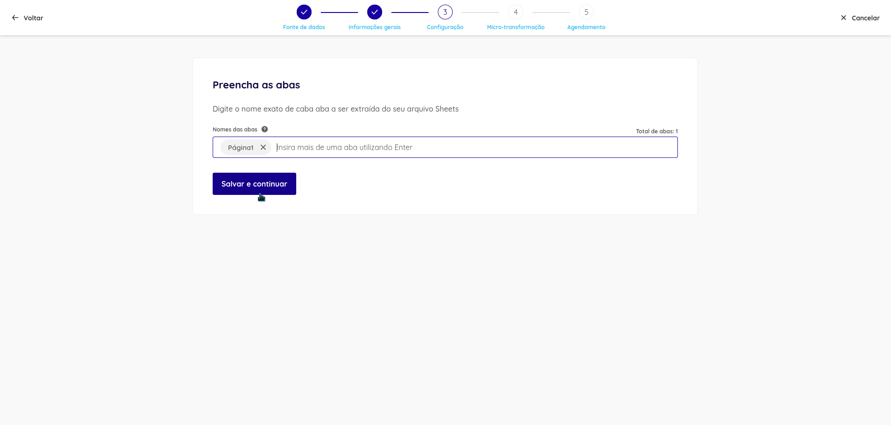
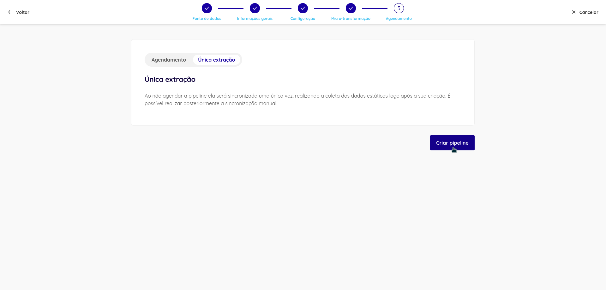

Depois de preencher as informações da pipeline, fazer outras tentativas trocando algumas configurações e esperar um pouco finalmente a pipeline foi executada e os dados foram integrados com sucesso
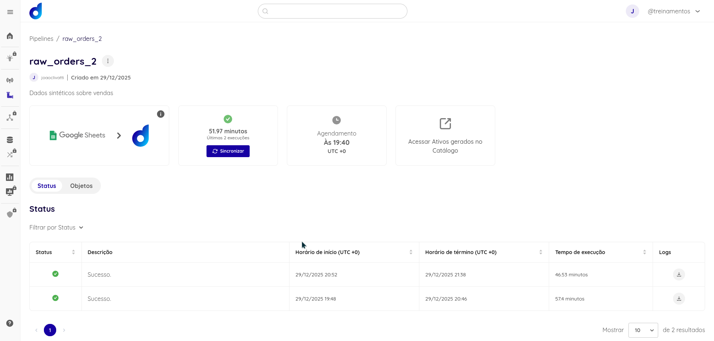
Link do ativo de pipelode de integração criado: [https://app.dadosfera.ai/pt-BR/collect/pipelines/ef42bcf9-425f-4b02-8d18-f14ca77f07df](https://app.dadosfera.ai/pt-BR/collect/pipelines/ef42bcf9-425f-4b02-8d18-f14ca77f07df)

## Item 3 - Exploração
Pelo que pude perceber, os dados foram automaticamente catalogados na plataforma da Dadosfera após a integração, a unica coisa que fiz foi alterar o nome da tabela no catálogo para "orders_landing_zone".

Link para o ativo de catálogo de dados criado: [https://app.dadosfera.ai/pt-BR/catalog/data-assets/f46eaba5-a04b-4902-baa9-c57b699df5e3](https://app.dadosfera.ai/pt-BR/catalog/data-assets/f46eaba5-a04b-4902-baa9-c57b699df5e3)

Com os dados já catalogados, pude explora-los através da plataforma da Dadosfera que me trouxe algumas estatísticas sobre cada coluna do conjunto e uma visualização de uma amostra dos dados em formato de tabela:
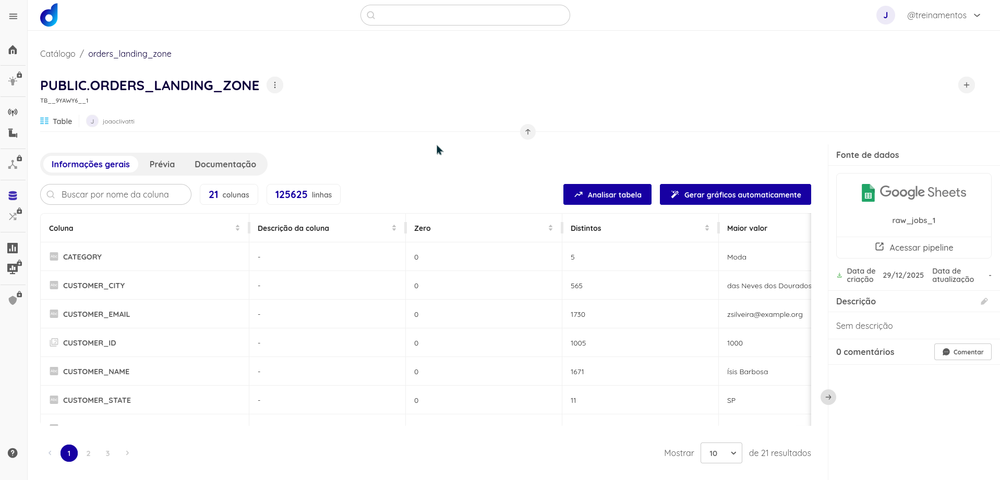
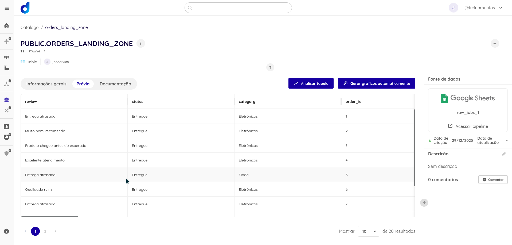

Explorando os dados, pude ver os defeitos que eu mesmo inseri propositalmente neles já que eu fiz o script que os gera. Entre os defeitos inseridos estão valores nulos, valores fora de um alcance de valores lógico, linhas duplicadas, endereços de e-mail fora do padrão e nomes com espaços em branco antes e depois do nome.

Tendo conhecimento sobre os defeitos da base de dados eu estava pronto para explora-los melhor com outras ferramentas.

## Item 4 - Data Quality
Para a etapa de verificação de qualidade de dados desenvolvi o script [data_quality_report.py](./scripts/silver/data_quality_report.py) que lê o conjunto de dados gerados pelo script [generate_data.py](./scripts/bronze/generate_data.py) em CSV com Pandas e faz validações de qualidade de dados com Great Expectations.

Para executar o script deve-se executa-lo como módulo: ```python -m scripts.silver.data_quality_report``` dentro do diretório raiz do projeto (lembrando que o venv deve ter sido criado e ativado)

As validações foram definidas com base em um Common Data Model (CDM) orientado a entidades de negócio, cobrindo regras de integridade, consistência e semântica dos dados.

Foram realizadas as seguintes verificações sobre o conjunto de dados:

**Customer:**
- Verificação de valores nulos nos campos customer_id, customer_name e customer_email.
- Validação de higiene de strings, garantindo que o campo customer_name não contenha espaços em branco no início ou no final.
- Validação do formato de e-mail, assegurando que os valores em customer_email sigam o padrão esperado.
- Validação de domínio, garantindo que o estado do cliente (customer_state) pertença ao conjunto de estados válidos.

**Order:**
- Verificação de unicidade do identificador do pedido (order_id), evitando registros duplicados.
- Verificação de valores nulos nos campos order_id e order_date.
- Validação de domínio do status do pedido (status), restringindo os valores a um conjunto previamente definido.
- Validação de integridade referencial, garantindo a presença de customer_id associado ao pedido.

**Order Item:**
- Verificação de valores nulos nos campos product_id, order_id, quantity e unit_price.
- Validação de intervalos lógicos, garantindo que:
- A quantidade (quantity) seja maior ou igual a 1.
- O preço unitário (unit_price) seja maior que zero, com tolerância controlada.

**Payment:**
- Validação de domínio do método de pagamento (payment_method), restringindo os valores aos meios aceitos.
- Verificação de integridade referencial, garantindo a associação do pagamento a um pedido (order_id).

**Shipping:**
- Validação de regras de negócio, assegurando que pedidos cancelados não possuam data de envio (shipping_date).
- Verificação de consistência temporal, garantindo que a data de envio seja posterior à data do pedido para pedidos não cancelados.

**Review:**
- Validação de regras de negócio, garantindo que pedidos cancelados não possuam avaliações (review).

Ao final da execução, o script gera um relatório de validação no console, informando o status geral da qualidade dos dados, o total de expectativas avaliadas e o detalhamento das validações que apresentaram falhas:

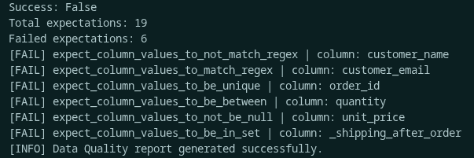

O pipeline de Data Quality foi executado com sucesso e identificou cinco violações relevantes nos dados de entrada:

- Nomes de clientes com espaços em branco antes e/ou depois do nome
- Endereços de e-mail fora do padrão
- Id de compra duplicados
- Valores fora de uma faixa de valores lógica no campo 'quantity'
- Valores nulos de valor unitário
- Valores de data de compra antes de valores de data de entrega e vice versa

Para tratar esses defeitos nos dados optei por utilizar PySpark(Spark) por ser uma ferramenta muito adequada para cenários de produção e de grandes volumes de dados, e também por ser uma ferramenta que já uso há alguns anos(apesar de também trabalhar com Pandas, R, etc).

Desenvolvi um script com PysPark que lê os dados crus, corrige da forma mais adequada possível(procurando recuperar dados) cada um dos defeitos que encontrei com o Great Expectations e grava o dataset limpo localmente em [data/clean/clean_orders/](./data/clean/clean_orders/). O script pode ser executado como módulo com o comando ```python -m scripts.silver.clean``` dentro do diretório raiz do projeto (lembrando que o venv deve ter sido criado e ativado e é necessário ter um JDK insatalado para executar Spark, de preferência o 17).

Agora se mudarmos os parametros da função de data quality para que ela verifique a qualidade de dados sobre os dados limpos pelo script PySpark e executarmos o script novamente com o comando ```python -m scripts.silver.data_quality_report``` será possível observar que o conjunto de dados limpos passa em todas as condições de qualidade de dados definidas no script as quais os dados crus não passavam:
```python
if __name__ == "__main__":
    # data_quality_report(dataset="raw", dataset_path="./data/raw/synthetic_data_full.csv")
    data_quality_report(dataset="clean", dataset_path="./data/clean/clean_orders/*.csv")
```


Após isso fiz o mesmo procedimento do [Item 2](#item-2---integração), primeiro executei o script que carrega os dados([scripts/ingest.py](./scripts/ingest.py)) no Google Sheets com outros parâmetros como mostrado abaixo e depois fiz as etapas manuais na plataforma para integrar e catalogar também os dados limpos na plataforma da Dadosfera.
```python
if __name__ == "__main__":
    ingest_data_to_sheets(
        csv_folder="./data/clean/clean_orders",
        secret_path="client_secret.json",
        env_path=".env",
        spreadsheet_name="clean_orders"
    )
```

Link para a conexão utilizada para a integração dos dados refinados: [https://app.dadosfera.ai/pt-BR/collect/connections/1767033270091_3wte0afg_google-sheets-1.0.0](https://app.dadosfera.ai/pt-BR/collect/connections/1767033270091_3wte0afg_google-sheets-1.0.0)

Link para a pipeline de integração gerada para os dados refinados: [https://app.dadosfera.ai/pt-BR/collect/pipelines/39749d88-1957-4f85-8b45-460b99c2c29e](https://app.dadosfera.ai/pt-BR/collect/pipelines/39749d88-1957-4f85-8b45-460b99c2c29e)

Link para o catálogo dos dados refinados gerado sobre os dados refinados: [https://app.dadosfera.ai/pt-BR/catalog/data-assets/f40eca18-f2c8-4b04-84b8-efd482486a93](https://app.dadosfera.ai/pt-BR/catalog/data-assets/f40eca18-f2c8-4b04-84b8-efd482486a93)

## Item 5 - Processamento
O dataset que escolhi para esse item é o dataset que baixei para o diretório [./data/raw/](./data/raw/) e que se encontra para download [nesse link](https://raw.githubusercontent.com/octaprice/ecommerce-product-dataset/main/data/mercadolivre_com_br/reviews_mercadolivre_com_br_1.json), o dataset se trata de um pouco mais de 100 mil registros em JSON de avaliações de produtos do Mercado Livre, cada registro contendo a data da avaliação, uma nota numérica, uma avaliação textual e o link original produto avaliado, sendo possível extrair features dos campos de avaliação textual e do link.

Para executar o código de extração de features optei por utilizar o Google Colab como indicado pela documentação do case por ser um ambiente mais preparado para esse tipo de código.

Por estar trabalhando com IA, utilizei modelos do HuggingFace, o que me fez precisar criar uma conta no HuggingFace, criar um token e registrar esse token com o nome 'HF_TOKEN' no Colab para que eu pudesse utilizar os modelos.

Criei um diretório chamado 'data' e dentro dele outro diretório chamado 'raw' e copiei o [arquivo JSON](./data/raw/reviews_mercadolivre_com_br_1.json) para dentro desse diretório manualmente.

Em seguida, desenvolvi um [script](./scripts/bronze/extract_features.py) que utiliza inteligência artificial para extrair informações adicionais de forma programática a partir dos campos content e product_url do JSON original. Entre essas informações, estão: uma lista de tópicos relacionados ao produto, um campo que indica se o usuário recomenda ou não o produto, e uma análise de sentimento que classifica a avaliação como muito negativa, negativa, neutra, positiva ou muito positiva.""Em seguida, desenvolvi um script que utiliza duas inteligências artificiais para enriquecer os dados extraídos do JSON original (content e product_url).

- A primeira IA, ```tabularisai/multilingual-sentiment-analysis```, foi utilizada para análise de sentimento, classificando cada avaliação como muito negativa, negativa, neutra, positiva ou muito positiva.
Além disso, o script gera um campo que indica se o usuário recomenda ou não o produto, com base no sentimento detectado.

- A segunda IA, ```MoritzLaurer/mDeBERTa-v3-base-mnli-xnli```, foi aplicada em uma tarefa de zero-shot classification para identificar tópicos relevantes mencionados pelo usuário no review e no nome do produto.

Por fim o script grava esse novo JSON com as features dentro do mesmo diretório do original.

Neste repositório é possível acessar apenas uma [amostra dos dados](./data/raw/reviews_with_features_sample.json) com features pois infelizmente o processamento que o Colab me disponibilizou não me possibilitou processar os 100 mil registros.

Link do notebook no Google Colab: [https://colab.research.google.com/drive/1SFUiHRGKOBzaAmnVFbexMwzCe7iYlsmM](https://colab.research.google.com/drive/1SFUiHRGKOBzaAmnVFbexMwzCe7iYlsmM)

## Item 6 - Modelagem
Para definir um modelo de dados sobre o conjunto de dados de vendas optei por começar desenvolvendo um script PySpark que modela os dados posteriormente limpos por outro script PySpark pois estou mais acostumado a olhar o schema dos dados por meio do código e a partir disso modelar as tabelas.

O script desenvolvido pode ser executado com o comando ```python -m scripts.gold.data_modeling``` dentro do venv, ao ser executado ele lê localmente os [dados limpos](./data/clean/) e armazena os dados modelados localmente em uma [camada de analytics](./data/analytics/).

### Modelagem definida:
Durante o desenvolvimento do [script de modelagem](./scripts/gold/data_modeling.py) eu desenvolvi o seguinte modelo:
```
fact_order schema:
root
 |-- order_id: integer (nullable = true)
 |-- order_date_sk: string (nullable = true)
 |-- shipping_date_sk: string (nullable = true)
 |-- customer_sk: string (nullable = true)
 |-- product_sk: string (nullable = true)
 |-- payment_method_sk: string (nullable = true)
 |-- order_status_sk: string (nullable = true)
 |-- quantity: integer (nullable = true)
 |-- unit_price: double (nullable = true)
 |-- total_amount: double (nullable = true)

dim_date schema:
root
 |-- full_date: date (nullable = true)
 |-- day: integer (nullable = true)
 |-- month: integer (nullable = true)
 |-- month_name: string (nullable = true)
 |-- quarter: integer (nullable = true)
 |-- year: integer (nullable = true)
 |-- day_of_week: string (nullable = true)
 |-- is_weekend: boolean (nullable = false)
 |-- date_sk: string (nullable = true)

dim_order_status schema:
root
 |-- status: string (nullable = true)
 |-- order_status_sk: string (nullable = true)

dim_payment_method schema:
root
 |-- payment_method: string (nullable = true)
 |-- payment_method_sk: string (nullable = true)

dim_product schema:
root
 |-- product_id: integer (nullable = true)
 |-- product_name: string (nullable = true)
 |-- category: string (nullable = true)
 |-- supplier: string (nullable = true)
 |-- product_sk: string (nullable = true)

dim_customer schema:
root
 |-- customer_id: integer (nullable = true)
 |-- customer_name: string (nullable = true)
 |-- customer_email: string (nullable = true)
 |-- customer_sk: string (nullable = true)
 |-- location_sk: string (nullable = true)

dim_location schema:
root
 |-- city: string (nullable = true)
 |-- state: string (nullable = true)
 |-- location_sk: string (nullable = true)
```
Estes são os schemas de cada tabela definida para o modelo dimensional de dados que visa identificar cada entidade de dados e suas variáveis e tornar consultas analíticas mais eficientes.

A modelagem proposta segue os princípios de Dimensional Modeling (Kimball), adotando um Snowflake Schema, com uma tabela fato central (fact_order) e dimensões descritivas ao redor.
Essa abordagem foi escolhida por favorecer simplicidade, performance analítica e facilidade de consumo por ferramentas de BI, sendo adequada ao cenário de pedidos e vendas do cliente.

### Visões finais dos dados:
- 📊 Visão 1 – Vendas por período e produto
```SQL
SELECT
    d.year,
    d.month,
    p.category,
    p.product_name,
    SUM(f.quantity) AS total_quantity,
    SUM(f.total_amount) AS total_revenue
FROM fact_order f
JOIN dim_date d ON f.order_date_sk = d.date_sk
JOIN dim_product p ON f.product_sk = p.product_sk
GROUP BY d.year, d.month, p.category, p.product_name;
```
Vendas por período e produto permite analisar o desempenho comercial ao longo do tempo, detalhando vendas e receita por produto e categoria, apoiando decisões relacionadas a planejamento, estoque e estratégia de vendas.

- 👤 Visão 2 – Comportamento do cliente
```SQL
SELECT
    c.customer_name,
    l.city,
    l.state,
    COUNT(DISTINCT f.order_id) AS total_orders,
    SUM(f.total_amount) AS total_spent
FROM fact_order f
JOIN dim_customer c ON f.customer_sk = c.customer_sk
JOIN dim_location l ON c.location_sk = l.location_sk
GROUP BY c.customer_name, l.city, l.state;
```
Comportamento do cliente possibilita analisar padrões de consumo dos clientes, considerando volume de pedidos, valor gasto e localização geográfica, sendo útil para segmentação, marketing e identificação de clientes estratégicos.

### Diagrama da Modelagem Dimensional:
Baseado no modelo que desenvolvi no script, criei um diagrama relacional do modelo de dados:
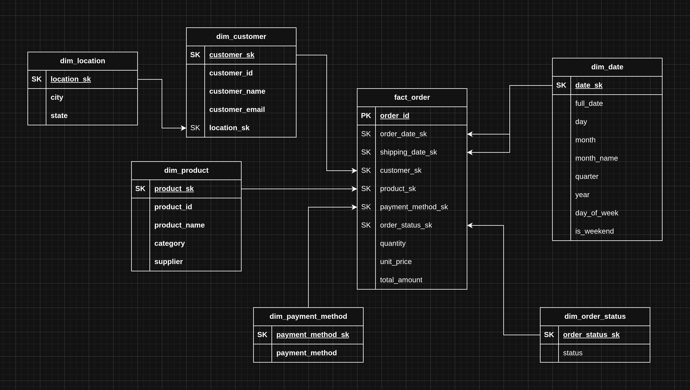

## Item 7 - Análise
Para iniciar a etapa de análise comecei clicando no módulo de 'Visualização' da plataforma da Dadosfera:


Depois disso fui direcionado para a pagina de login do Metabase onde fiz login com as mesmas credenciais da Dadosfera, depois de logado tive acesso à pagina inicial do Metabase onde cliquei no ícone de três pontos na seção de 'coleções' e cliquei em 'Coleção nova':
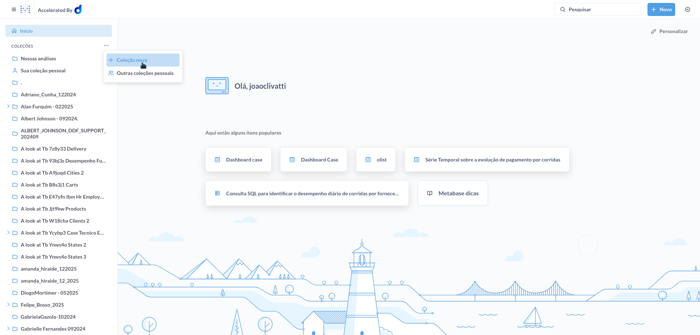

Com isso o site abre um modal onde defini o nome da minha coleção de acordo com o padrão de nome indicado na documentação do case e cliquei em 'Criar' para finalmente criar a coleção:
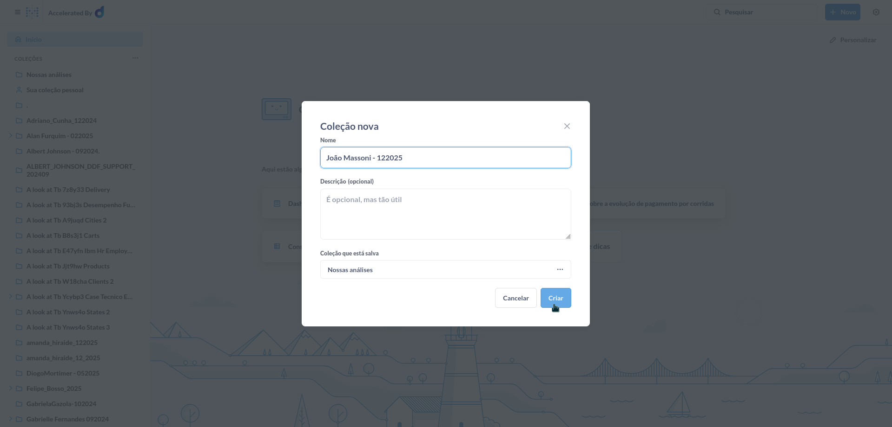
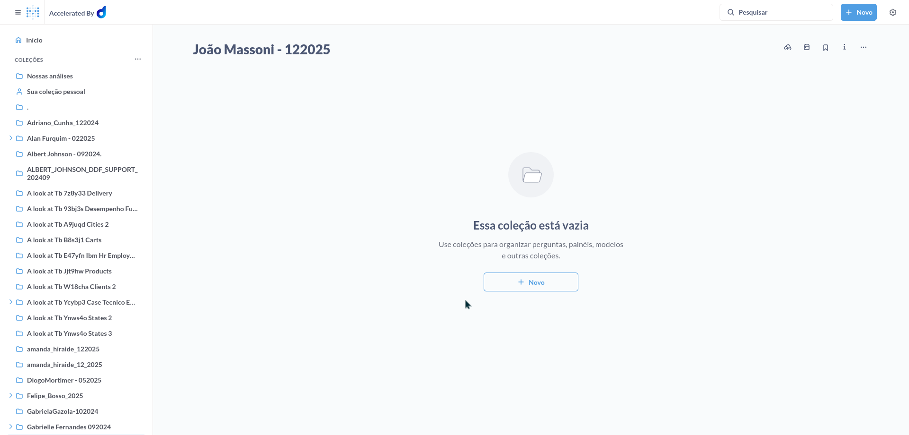

Para criar a Dashboard(painel) onde iria colocar os gráficos da análise cliquei no botão '+ Novo' na tela da minha coleção e depois cliquei em 'Painel':
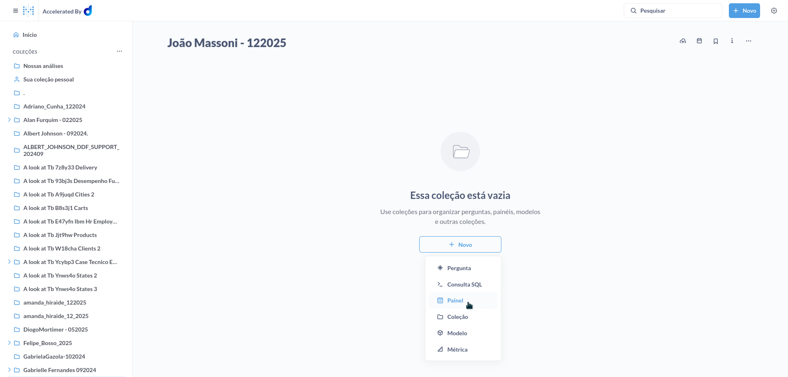

No modal que abriu eu defini um nome para a minha Dashboard e cliquei em 'Criar' para finalmente criar a Dashboard:
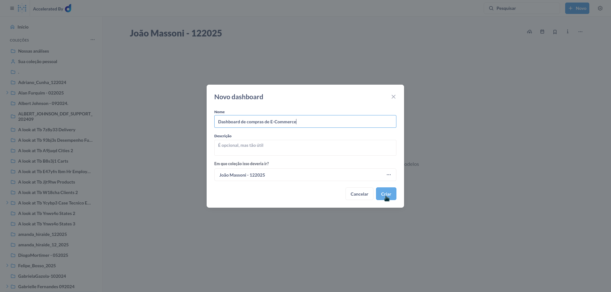

Com isso fui redirecionado para a página da nova Dashboard recém criada onde cliquei em 'Adicionar um gráfico' e depois em 'Nova consultan SQL' para iniciar a criação dos gráficos:
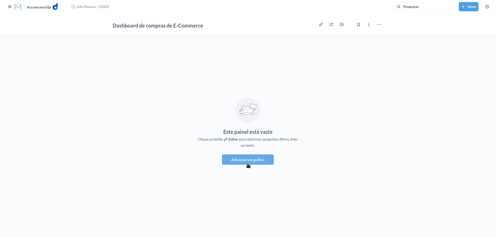
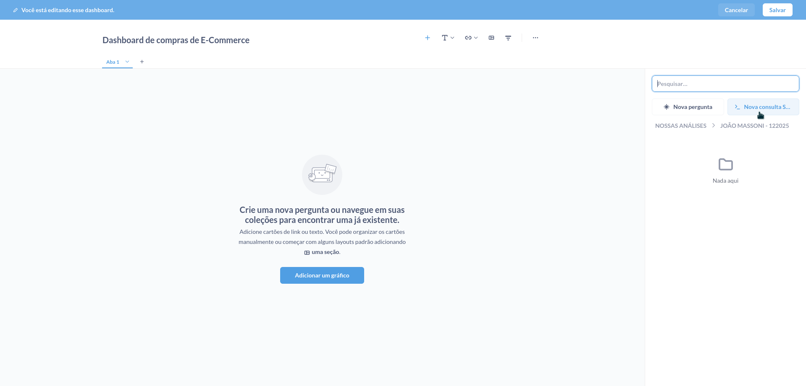

Depois disso fui redirecionado para a tela de criação de gráficos onde selecionei o banco de dados 'Snmowflake' onde estava localizada a minha tabela de dados refinados:
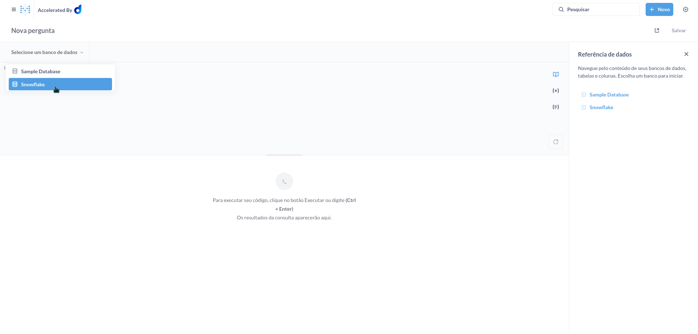

Com isso pude desenvolver e executar queries SQL e depois gerar gráficos, a primeira query executada gera um gráfico de barras para comparação de renda gerada por cada categorias:

Código da query:
```SQL
SELECT
  category,
  SUM(quantity * unit_price) AS total_revenue
FROM orders
GROUP BY category
ORDER BY total_revenue DESC;
```
Pergunta: ``Quais categorias mais geram receita?``

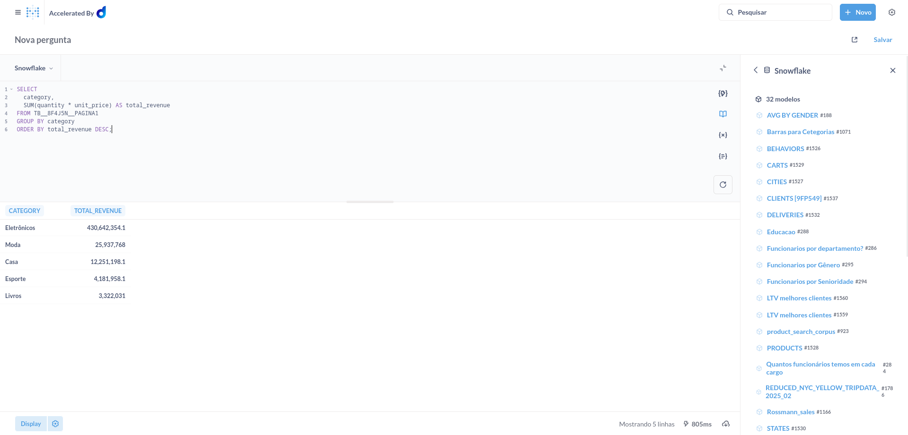

Depois de executar a query e ver o resultado cliquei em 'Display' e e depois selecionei o tipo de gráfico de barras: 
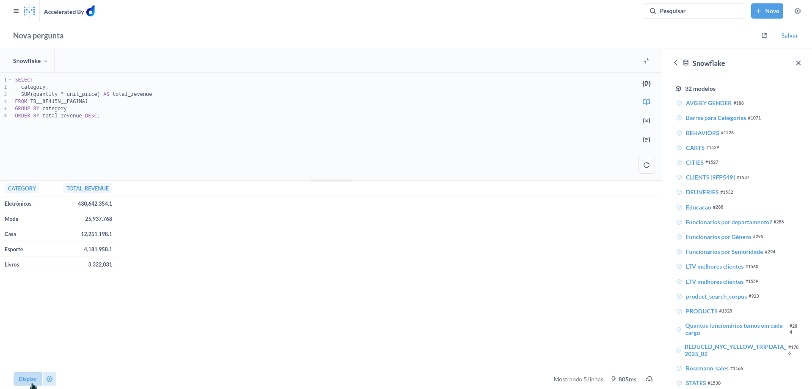
.png)

Por fim salvei o gráfico e fui redirecionado para a página da dashboard com o novo gráfico já inserido nela, esse processo foi repetido para todos os graficos seguintes
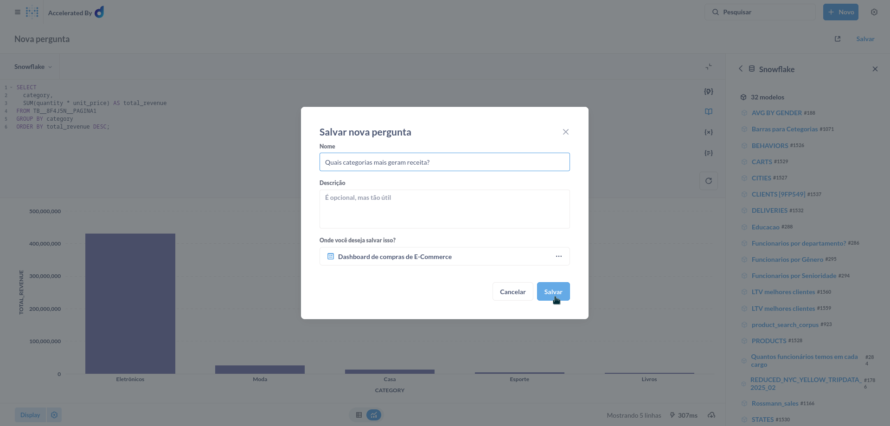

repeti o processo para o grafico de linhas para análise de série temporal onde é possível ver a variação de renda ao longo dos meses do ano:

Código da query:
```SQL
SELECT
  DATE_TRUNC('month', order_date) AS month,
  SUM(quantity * unit_price) AS total_revenue
FROM orders
GROUP BY month
ORDER BY month;
```
Pergunta: ``Como a receita evolui mensalmente?``

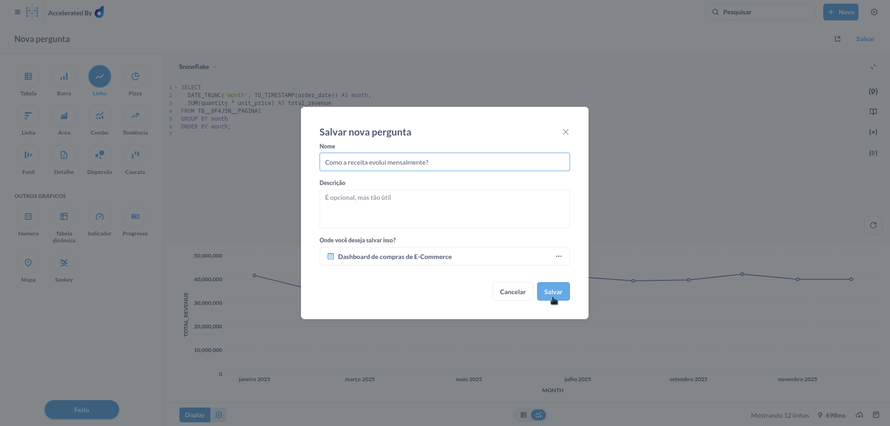

Após os dois primeiros gráficos estarem prontos pude ve-los na dashboard e parti para a criação dos outros cinco gráficos e perguntas:
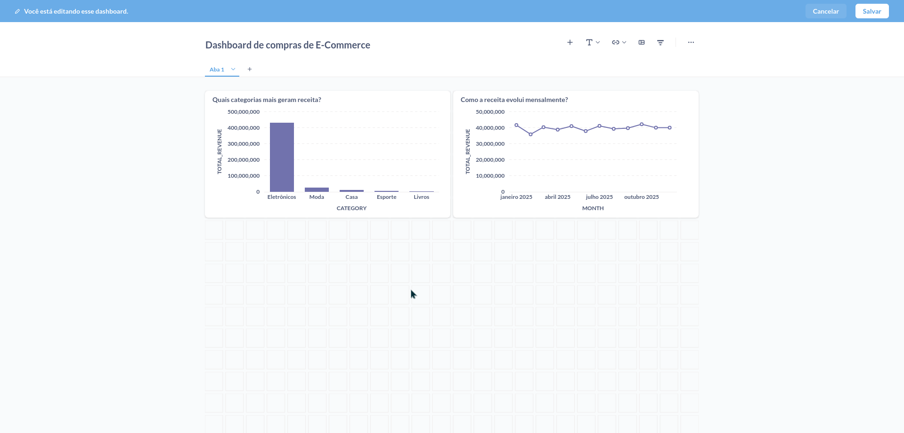

### Perguntas:

#### Pergunta 1 (Gráfico de Mapa):

Código da query:
```SQL
SELECT
  customer_state,
  SUM(quantity * unit_price) AS total_revenue
FROM orders
GROUP BY customer_state;
```
Pergunta: ``Quais estados representam mais receita?``

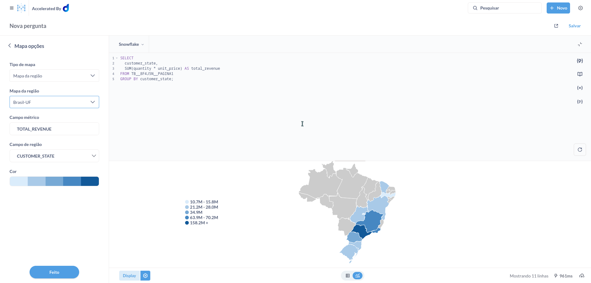

#### Pergunta 2 (Gráfico de Cascata):

Código da query:
```SQL
SELECT
  category,
  ROUND(SUM(quantity * unit_price) / COUNT(*), 2) AS avg_order_revenue
FROM TB__8F4J5N__PAGINA1
GROUP BY category
ORDER BY avg_order_revenue DESC;
```
Pergunta: ``Quais categorias geram mais receita por pedido?``

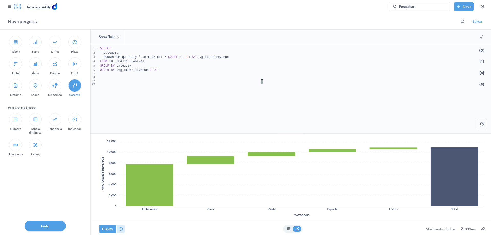

#### Pergunta 3 (Gráfico de Combo):

Código da query:
```SQL
SELECT
  customer_state,
  COUNT(*) AS total_vendas,
  SUM(CASE WHEN status = 'Cancelado' THEN 1 ELSE 0 END) AS total_cancelamentos,
  ROUND(
    100.0 * SUM(CASE WHEN status = 'Cancelado' THEN 1 ELSE 0 END) / COUNT(*),
    2
  ) AS pct_cancelamento
FROM TB__8F4J5N__PAGINA1
GROUP BY customer_state
ORDER BY pct_cancelamento DESC;
```
Pergunta: ``Quais estados tem as maiores porcentagens de cancelamento de pedidos?``

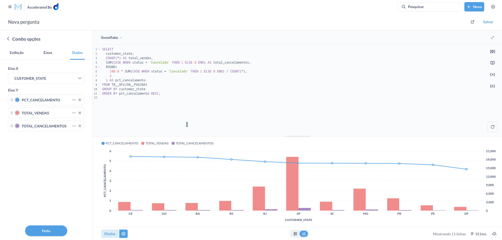

#### Pergunta 4 (Gráfico de Linhas):

Código da query:
```SQL
SELECT
  customer_state,
  ROUND(
    100.0 * SUM(
      CASE
        WHEN DATEDIFF(
          'day',
          CAST(order_date AS TIMESTAMP),
          CAST(shipping_date AS TIMESTAMP)
        ) <= 5 THEN 1 ELSE 0
      END
    ) / COUNT(*),
    2
  ) AS pct_within_sla
FROM TB__8F4J5N__PAGINA1
WHERE shipping_date IS NOT NULL
GROUP BY customer_state
ORDER BY pct_within_sla DESC;
```
Pergunta: ``Qual é a porcentagem de entrega dentro de 5 dias de cada estado?``

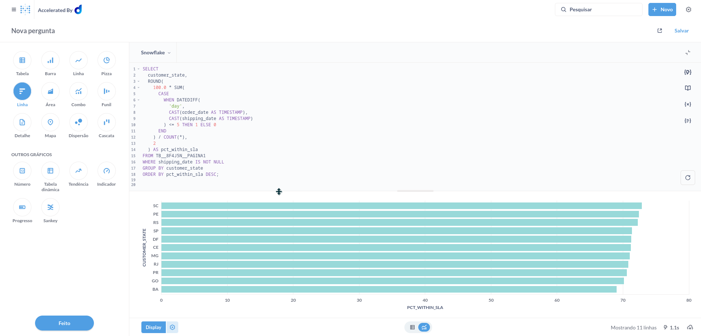

#### Pergunta 5 (Gráfico de Dispersão):

Código da query:
```SQL
SELECT
  product_id,
  product_name,
  category,
  ROUND(AVG(unit_price), 2) AS avg_unit_price,
  COUNT(*) AS total_orders,
  ROUND(SUM(quantity * unit_price), 2) AS total_revenue
FROM TB__8F4J5N__PAGINA1
WHERE unit_price IS NOT NULL
GROUP BY product_id, product_name, category
HAVING COUNT(*) >= 5
ORDER BY avg_unit_price;
```
Pergunta: ``Existe relação entre o preço do produto e o volume de pedidos?``

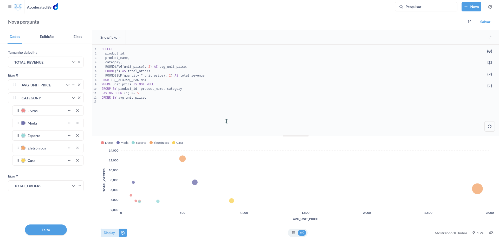

Depois de criar todos esses gráficos respondendo às perguntas finalmente obtive a dashboard finalizada:
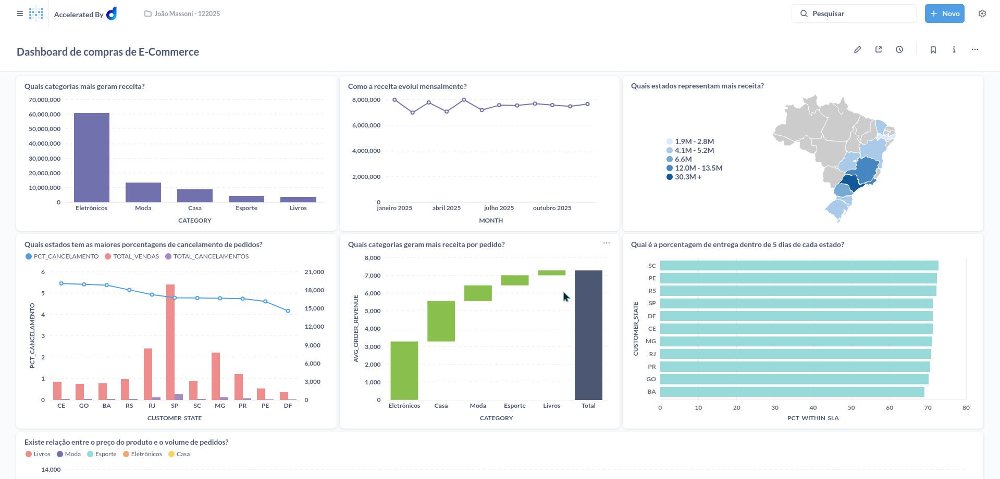
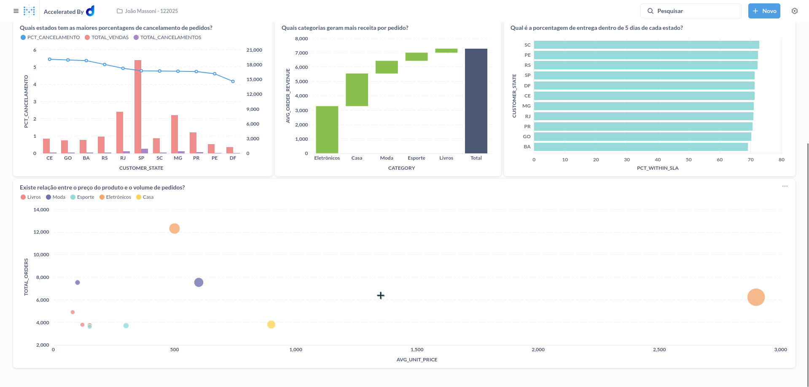
Link para o dashboard criado na plataforma: [https://app.dadosfera.ai/pt-BR/catalog/data-assets/b5f770a6-1de2-4bc9-ada3-2bd190dd9c28](https://app.dadosfera.ai/pt-BR/catalog/data-assets/b5f770a6-1de2-4bc9-ada3-2bd190dd9c28)

## Item 8 - Pipelines
Pelo que entendi sobre o Item 8 sem saber eu acabei fazendo esse item já nas etapas anteriores, portanto vou listar aqui os script que compõe as pipelines que desenvolvi ao longo do case.

Acredito que essas pipelines poderiam ser executadas na plataforma da Dadosfera porém eu não obtive acesso ao módulo de transformação mas desenvolvi as pipelines de qualquer forma. Independente disso acredito que não teria problemas para utilizar esse módulo da plataforma uma vez que tenho experiência em criar pipelines de dados.

### Pipeline de dados sintéticos de vendas:
- Task 1 - [generate_data.py](./scripts/bronze/generate_data.py):

    O primeiro script dessa pipeline é o script que gera os [dados sintéticos](./data/raw/synthetic_data_full.csv) com a biblioteca Faker e os salva localmente em formato CSV, representando a primeira etapa de extração de dados.

- Task 2 - [ingest.py](./scripts/ingest.py):

    O segundo script dessa pipeline é o que pega os dados gerados pelo primeiro script e os salva em formato de planilha no Google Sheets se comunicando com sua API.

- Task 3 - Conectar, ingerir e catalogar dados:

    Essa terceira etapa da pipeline infelizmente precisou ser manual por eu não ter conseguido utilizar a API da Dadosfera para automatizar, mas ela se trata basicamente da criação manual na plataforma da Dadosfera de uma conexão com o Google Sheets, a criação de uma pipeline da plataforma que ingere os dados usando essa conexão e por fim a catalogação dos dados ingeridos feita de forma automática pela prataforma.

- Task 4 [data_quality_report.py](./scripts/silver/data_quality_report.py):

    Esse script utiliza a biblioteca Great Expectations para realizar verificações de qualidade de dados localmente sobre a base de dados anteriormente ingerida e depois gera um relatório sobre os defeitos encontrados.

- Task 5 [clean.py](./scripts/silver/clean.py):

    Esse script PySpark Realiza a limpeza e correção de todos os possíveis defeitos encontrados pelo script anterior e salva também localmente os [dados com qualidade](./data/clean/clean_orders/) garantida em formato CSV.

- Task 6 - [ingest.py](./scripts/ingest.py):

    Novamente é executado o mesmo script da Task 2 porém dessa vez com uma alteração de parametros que faz ele carregar o novo conjunto de dados tratados em formato de planilha no Google Sheets.

- Task 7 - Conectar, ingerir e catalogar dados:

    Essa etapa da pipeline trata-se do exato mesmo processo manual da Task 3 porém agora feito sobre o novo conjunto de dados tratados.

- Task 8 - [data_modeling.py](./scripts/gold/data_modeling.py):

    Esse script PySpark lê o conjunto de dados tratados armazenados localmente e realiza uma [modelagem dimensional](./data/analytics/) sobre os dados com o objetivo de melhorar consultas analíticas, dividindo o conjunto de uma para 7 tabelas gravadas localmente em Parquet.

- Task 9 - [ingest.py](./scripts/ingest.py):

    Novamente é executado o mesmo script das Tasks 2 e 6 porém dessa vez com uma alteração de parametros que faz ele carregar os novos conjuntos de dados normalizados em formato de planilha no Google Sheets.

- Task 10 - Conectar, ingerir e catalogar dados:

    Essa etapa da pipeline trata-se do extamo mesmo processo manual da Tasks 3 e 7 porém agora feito sobre o novo conjunto de dados modelados.

### Pipeline de dados sobre avaliações de produtos do Mercado Livre:

- Task 1 - Baixar os dados do Github:

    A primeira etapa se trata apenas de baixar os dados do repositório no Github executando o seguinte comando no diretório raiz do projeto:
    ```
    wget https://raw.githubusercontent.com/octaprice/ecommerce-product-dataset/main/data/mercadolivre_com_br/reviews_mercadolivre_com_br_1.json
    ```

- Task 2 - [extract_features.py](./scripts/bronze/extract_features.py)

    A segunda e última etapa dessa pipeline se trata simplesmente de executar um script Python que utiliza modelos de IA do HuggingFace para extrair features a mais para o conjunto de dados de forma programática e gravar um [conjunto de dados enriquecido por IA](./data/raw/reviews_with_features_sample.json)

## Item 9 - Data Apps
Iniciei desenvolvendo o código do [app Streamlit](./app/streamlit_app.py) o qual consome os [dados modelados](./data/analytics/) e apresenta uma exploração mais detalhada dos dados, contendo desde métricas importantes sobre os dados, alguns gráficos básicos até análises dos valores presentes em variáveis categóricas e numéricas.

Com o código do app pronto, foi possível executar o projeto (rodando em http://localhost:8502) com o comando `streamlit run ./app/streamlit_app.py` (com o venv instalado e ativado), dividi o app em abas e adicionei alguns filtros do lado esquerdo da tela e esse foi o resultado:

**Aba de Visão Geral:** Visão geral sobre vendas e faturamento.


**Aba de Análise Temporal:** Gráficos envolvendo séries temporais.
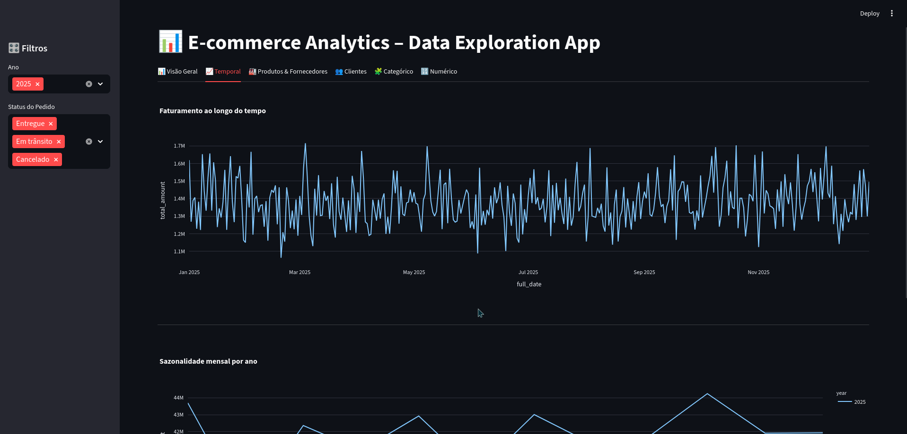

**Aba de Produtos e Fornecedores:** Análise de performance de produtos e fornecedores.
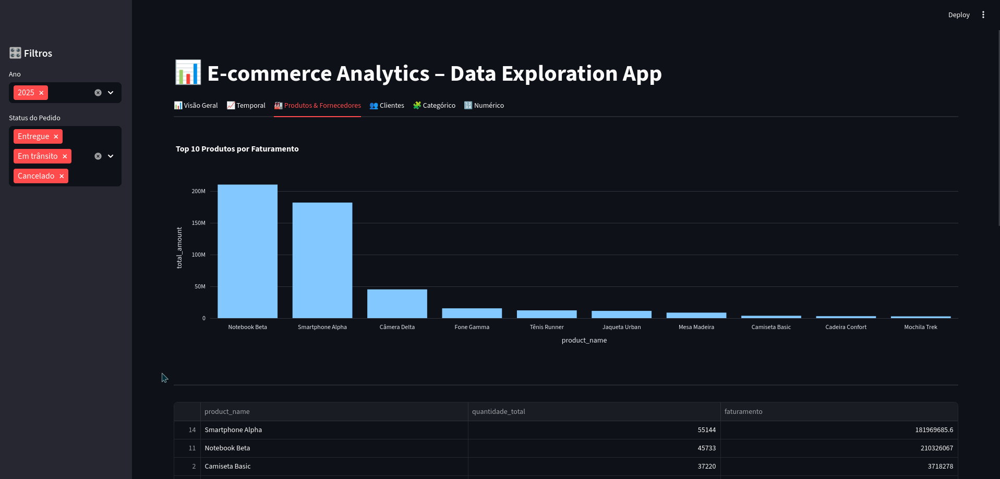

**Aba de Clientes**: Análise de clientes mais fiéis.
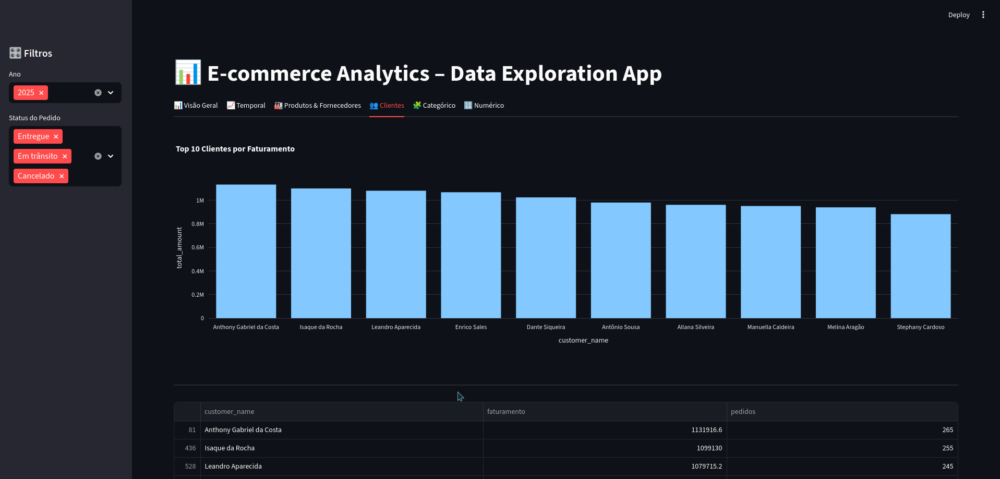

**Aba de Variáveis Categoricas:** Análise de valores únicos e contagens de cada valor em variáveis categóricas.
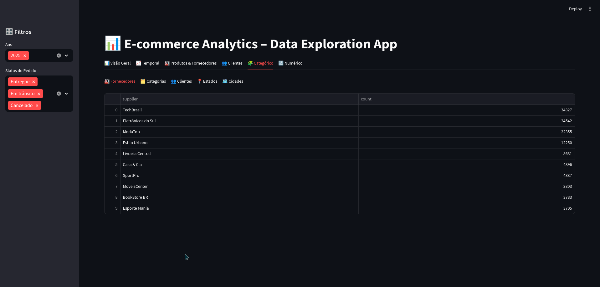

**Aba de Variáveis Numéricas:** Análise estatística, de distribuição, de outliers e de correlação sobre variáveis numéricas.


Com o app pronto e presente no repositório do Github com o arquivo requirements.txt foi possível começar o processo de deploy dele, comecei clicando no botão 'Deploy' no canto superior direito da tela e depois clicando em 'Deploy now' 
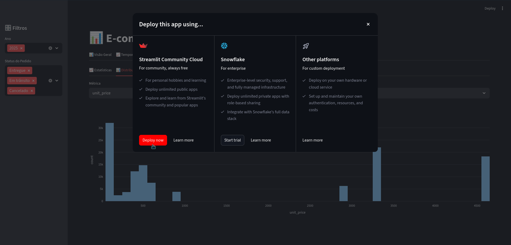

Com isso fui redirecionado para a página inicial do Streamlit Community Cloud onde cliquei na opção de sign-in para logar na plataforma
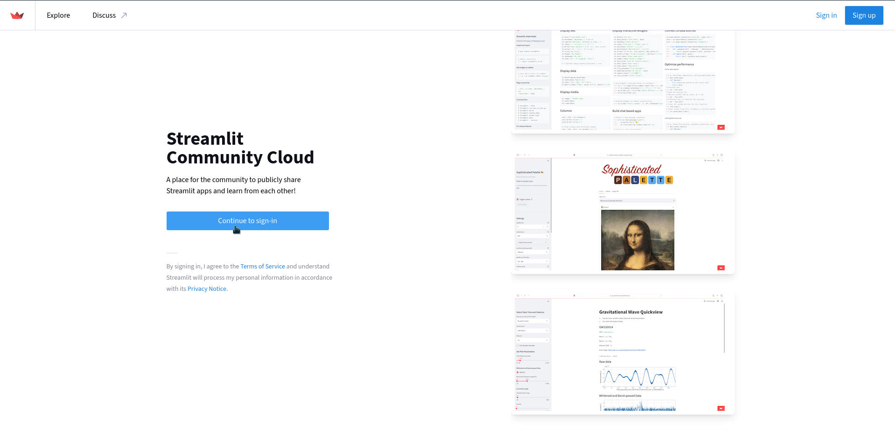

Após logar com o Github fui redirecionado para essa página de Deploy onde cliquei em 'Deploy' para finalmente fazer deploy da aplicação
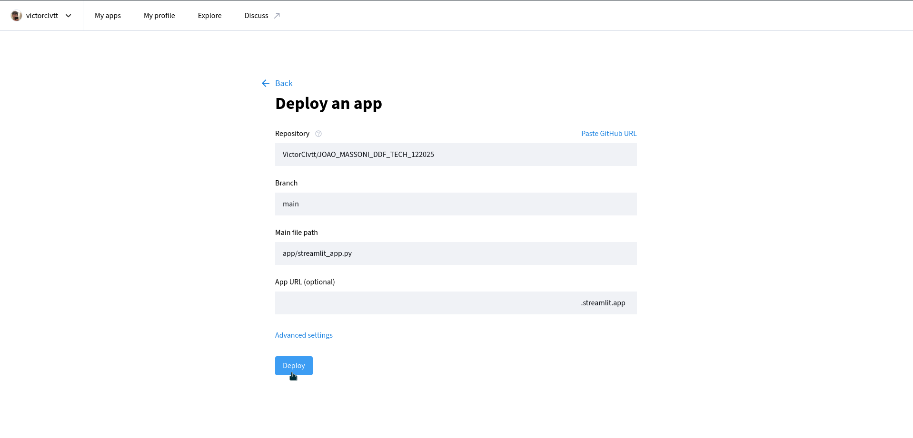

Depois de esperar alguns segundos da aplicação fazendo setup o app rodou perfeitamente no Streamlit Community Cloud na URL [https://joaomaappniddftech122025-4crwqr9moiymepanvcgfka.streamlit.app/](https://joaomaappniddftech122025-4crwqr9moiymepanvcgfka.streamlit.app/)
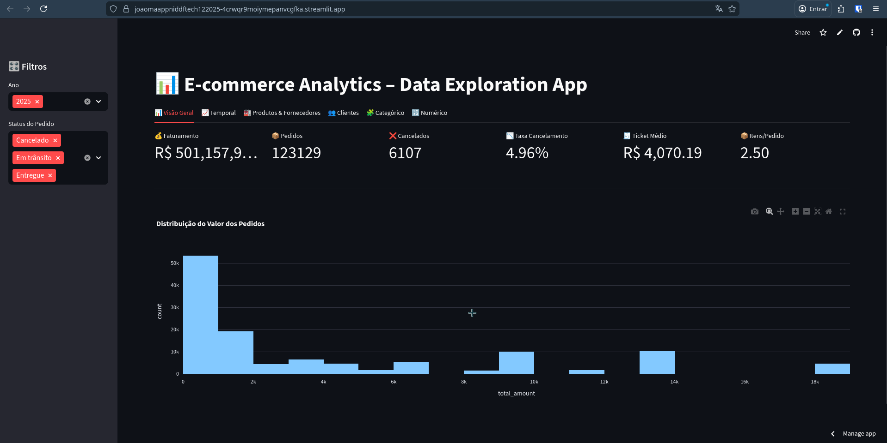

## Item 10 - Apresentação
O link da apresentação está no arquivo [video_link.txt](./docs/presentation/video_link.txt) mas também pode ser acessado por aqui: [https://www.youtube.com/watch?v=h1dv7p8Nig8](https://www.youtube.com/watch?v=h1dv7p8Nig8)

O vídeo foi postado no Youtube como não listado como pedido na documentação do case.

Muito obrigado pela oportunidade, espero que gostem do meu trabalho.

## Item Bonus - GenAI + Data Apps
Iniciei o desenvolvimento do [aplicativo em Streamlit para geração de imagens](./app/streamlit_image_generation_app.py) por IA, que consome exclusivamente a [dimensão de produtos (dim_product)](./data/analytics/dim_product/) proveniente dos [dados modelados](./data/analytics/) na camada analytics.

O aplicativo disponibiliza uma interface interativa que permite ao usuário selecionar um produto a partir da dimensão de produtos e, a partir dessa seleção, realizar requisições a um modelo de geração de imagens, utilizando as informações do produto como base para a geração, que resulta em uma imagem gerada pela IA mostrada no app.

Após executar o app da mesma forma que executei o app do [Item 9](#item-9---data-apps) pude ver a interface dele, onde é possível selecionar o produto e depois clicar em 'gerar imagem do produto' para fazer a requisição de geração da imagem baseada no produto selecionado:
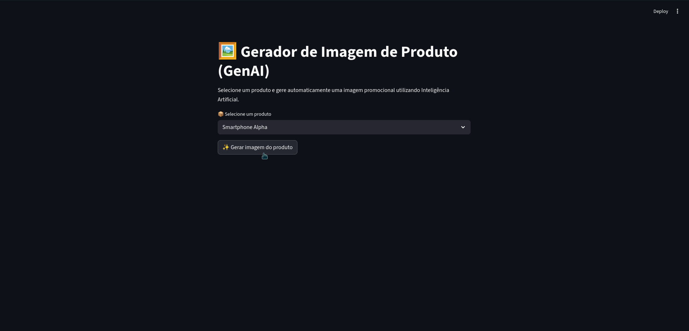

Após alguns segundos a imagem é gerada e mostrada abaixo do botão no app:
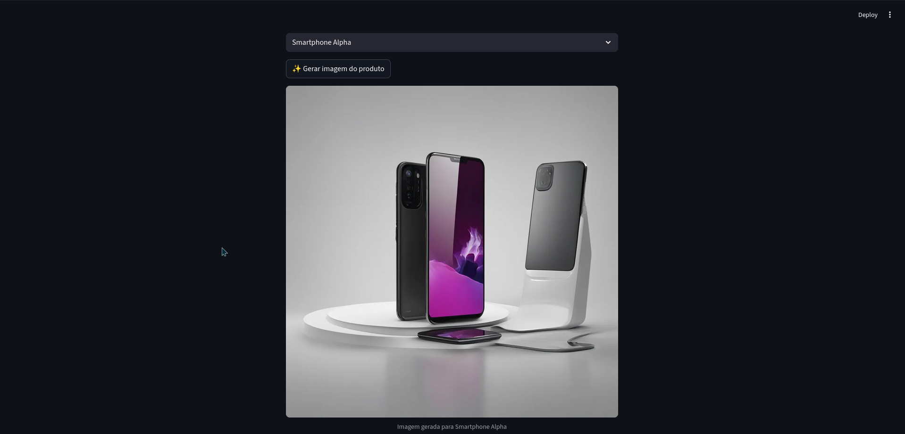

Também foi feito o deploy deste app no Streamlit Community Cloud da mesma forma que foi feito com o app do [item 9](#item-9---data-apps) e pode ser acessado pelo seguinte link: [https://joaomaappniddftech122025-jlmv5ywrbejznjli3kniyl.streamlit.app/](https://joaomaappniddftech122025-jlmv5ywrbejznjli3kniyl.streamlit.app/)
